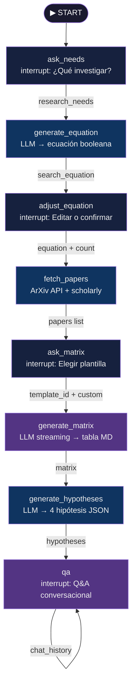

<div align="center">
  


  **Asistente de investigación académica con IA local — DataHack 2026, Reto 3**

  [](https://python.org)
  [](https://fastapi.tiangolo.com)
  [](https://langchain-ai.github.io/langgraph/)
  [](https://ollama.com)
  [](https://python.langchain.com)
  [](LICENSE)

  *Genera ecuaciones de búsqueda booleanas elaboradas · Captura papers de ArXiv y Google Scholar · Produce matrices bibliográficas en streaming · Propone hipótesis originales · Responde preguntas sobre la literatura — todo corriendo localmente, sin API keys.*

</div>

---

## Tabla de contenido

1. [Descripción](#-descripción)
2. [Características](#-características)
3. [Pipeline de investigación](#-pipeline-de-investigación)
4. [Arquitectura del sistema](#-arquitectura-del-sistema)
5. [Tecnologías](#-tecnologías)
6. [Instalación](#-instalación)
7. [Ejecución](#-ejecución)
8. [Uso paso a paso](#-uso-paso-a-paso)
9. [Modelos compatibles](#-modelos-compatibles)
10. [Plantillas de matrices](#-plantillas-de-matrices)
11. [Exportación de resultados](#-exportación-de-resultados)
12. [Estructura del proyecto](#-estructura-del-proyecto)
13. [Variables de entorno](#-variables-de-entorno)
14. [Solución de problemas](#-solución-de-problemas)

---

## 📖 Descripción

**InvestigIA** guía al investigador por un flujo estructurado de 8 etapas: desde la captura de necesidades hasta el Q&A conversacional sobre la literatura encontrada. Toda la inferencia ocurre en tu máquina con [Ollama](https://ollama.com) — sin costos por token, sin datos que salgan al exterior.

El sistema está construido sobre un grafo de estados ([LangGraph](https://langchain-ai.github.io/langgraph/)) con puntos de pausa (`interrupt`) que permiten que el usuario ajuste la ecuación de búsqueda, elija plantillas de matriz y haga preguntas en cualquier momento, mientras el servidor mantiene el estado de sesión con `MemorySaver`.

<div align="right"><a href="#tabla-de-contenido">↑ volver arriba</a></div>

---

## ✨ Características

| Característica | Descripción |
|---|---|
| **Ecuaciones booleanas elaboradas** | Genera consultas con AND / OR / NOT, frases exactas, wildcards y sinónimos agrupados por concepto |
| **Búsqueda dual** | Captura artículos de **ArXiv** (API oficial) y **Google Scholar** (`scholarly`) con metadatos bibliométricos completos |
| **Streaming de matrices** | La tabla bibliográfica se construye token a token en la UI; el usuario ve el progreso en tiempo real |
| **Hipótesis de investigación** | El agente propone 4 hipótesis originales y testeables basadas en los gaps identificados en la literatura |
| **Q&A conversacional** | Ciclo de preguntas/respuestas con historial, citando artículos específicos (autor, año) cuando es relevante |
| **Exportación XLSX / DOCX** | Descarga la matriz como archivo Excel con 3 hojas estilizadas o como documento Word |
| **Carga de PDFs** | Sube PDFs propios para incluirlos en el análisis |
| **Visualización de grafo** | Grafo de conocimiento interactivo (D3.js) sobre las conexiones entre papers |
| **Sesiones persistentes** | Reconectar al mismo `session_id` retoma el estado exacto donde lo dejaste |
| **100 % local** | No requiere OpenAI API key ni ningún servicio en la nube |

<div align="right"><a href="#tabla-de-contenido">↑ volver arriba</a></div>

---

## 🔬 Pipeline de investigación

```
Usuario:  "quiero investigar transformers para diagnóstico de enfermedades raras"

Agente:   ECUACIÓN:
          ("transformer" OR "BERT" OR "vision transformer" OR "ViT") AND
          ("rare disease" OR "orphan disease" OR "rare disorder") AND
          ("diagnosis" OR "classification" OR "detection") AND NOT ("survey" OR "review")

          EXPLICACIÓN:
          3 conceptos centrales: arquitectura transformer, enfermedades raras
          y tarea de diagnóstico. Se excluyeron surveys para priorizar
          trabajos experimentales con resultados cuantificables.

          [editor de ecuación + slider] Papers por fuente: 8

Usuario:  ✅ Confirmar ecuación · 8 papers por fuente

Agente:   [16 paper cards con DOI, citas, PDF link…]
          ¿Cómo quieres la matriz bibliográfica?

Usuario:  [selecciona plantilla "Benchmarking Técnico"]

Agente:   | Autores | Año | Modelo | Dataset | Accuracy | F1-Score | DOI |
          |---------|-----|--------|---------|----------|----------|-----|
          | Chen et al. | 2023 | ViT-B/16 | NORD-5k | 94.2% | 0.931 | ... |
          ...
          ## Análisis General
          **Tendencias dominantes:** ...
          [📊 Descargar XLSX] [📄 Descargar DOCX]

Agente:   💡 Hipótesis H1: Los modelos ViT pre-entrenados con datos sintéticos...
          💡 Hipótesis H2: La combinación de texto clínico y imagen histológica...

Usuario:  "¿Cuál de estos artículos tiene el mejor F1 y usa datos públicos?"
Agente:   Basándome en los artículos encontrados, Chen et al. (2023)…
```

<div align="right"><a href="#tabla-de-contenido">↑ volver arriba</a></div>

---

## 🏗️ Arquitectura del sistema

### Grafo LangGraph (8 nodos)



### Protocolo WebSocket (`/ws/{session_id}`)

**Servidor → Cliente**

| `type` | Cuándo | Payload relevante |
|---|---|---|
| `question` | Inicio de sesión | `content` — saludo con instrucciones |
| `status` | Operaciones lentas | `content` — texto de progreso |
| `equation` | Ecuación generada | `equation`, `explanation` |
| `papers` | Papers encontrados | `papers[]`, `templates[]` |
| `matrix_chunk` | Streaming de matriz | `content` — fragmento de texto MD |
| `qa` | Ciclo Q&A listo | `show_matrix`, `matrix`, `hypotheses[]`, `last_answer` |
| `error` | Excepción no capturada | `content` — mensaje de error |

**Cliente → Servidor**

| Etapa | Payload enviado |
|---|---|
| Tema | `{"type": "message", "content": "texto libre"}` |
| Ecuación | `{"type": "message", "content": "ecuación o 'confirmar'", "count": 8}` |
| Plantilla | `{"type": "message", "content": "personalización", "template_id": "benchmarking"}` |
| Q&A | `{"type": "message", "content": "pregunta sobre los papers"}` |

### Flujo de streaming de la matriz

```
WebSocket handler (async)
  │
  ├─ Registra asyncio.Queue en _matrix_streams[session_id]
  │
  ├─ asyncio.to_thread → graph.invoke(Command(resume=...))  [hilo separado]
  │       │
  │       └─ node_generate_matrix → llm.stream()
  │               │  chunk → loop.call_soon_threadsafe(q.put_nowait, chunk)
  │               └─ finally: q.put_nowait(None)  [señal de fin]
  │
  └─ while True: chunk = await queue.get()
          ├─ chunk != None → send_json({type: "matrix_chunk", content: chunk})
          └─ chunk == None → break → send status → await invoke_task
```

<div align="right"><a href="#tabla-de-contenido">↑ volver arriba</a></div>

---

## 🛠️ Tecnologías

| Capa | Tecnología | Versión | Rol |
|---|---|---|---|
| **Orquestación** | LangGraph | ≥ 0.2.55 | Grafo de estados con `interrupt()` y `MemorySaver` |
| **LLM local** | Ollama + llama3.1:8b | ≥ 0.3 | Generación de ecuaciones, matrices, hipótesis y Q&A |
| **Integración LLM** | LangChain-Ollama | ≥ 0.1.3 | `ChatOllama` con streaming y control de temperatura |
| **Backend** | FastAPI | ≥ 0.104 | Servidor ASGI; WebSocket + REST endpoints |
| **Runtime** | Uvicorn | ≥ 0.24 | Servidor ASGI con soporte async/await |
| **Frontend** | HTML + Tailwind + D3.js | — | SPA sin framework; grafo de conocimiento interactivo |
| **Markdown** | marked.js | — | Renderizado de la matriz y respuestas del agente |
| **ArXiv** | `arxiv` library | ≥ 2.1.3 | API oficial con búsqueda booleana y acceso a PDFs |
| **Scholar** | `scholarly` | ≥ 1.7.11 | Scraping de Google Scholar con citas y metadatos |
| **Exportación** | openpyxl + python-docx | ≥ 3.1.2 | Workbooks Excel y documentos Word estilizados |
| **PDF** | pdfplumber | ≥ 0.10 | Extracción de texto de PDFs subidos por el usuario |

<div align="right"><a href="#tabla-de-contenido">↑ volver arriba</a></div>

---

## 📦 Instalación

### Requisitos previos

| Herramienta | Versión mínima | Instalación |
|---|---|---|
| [Python](https://python.org) | 3.10+ | [python.org/downloads](https://www.python.org/downloads/) |
| [uv](https://docs.astral.sh/uv/) | cualquiera | `curl -LsSf https://astral.sh/uv/install.sh \| sh` |
| [Ollama](https://ollama.com) | 0.3+ | [ollama.com/download](https://ollama.com/download) |

### Pasos

```bash
# 1. Clona el repositorio
git clone https://github.com/tu-usuario/ResearchAgent-DataHack2026.git
cd ResearchAgent-DataHack2026

# 2. Crea el entorno virtual e instala dependencias
uv venv
uv pip install -r requirements.txt

# 3. Descarga el modelo de lenguaje (4.7 GB)
ollama pull llama3.1:8b
```

<div align="right"><a href="#tabla-de-contenido">↑ volver arriba</a></div>

---

## ▶️ Ejecución

```bash
# Terminal 1 — servidor Ollama (si no está corriendo como servicio del sistema)
ollama serve

# Terminal 2 — aplicación web
uv run uvicorn app.main:app --reload
```

Abre **[http://localhost:8000](http://localhost:8000)** en tu navegador.

Para usar un modelo diferente:

```bash
OLLAMA_MODEL=qwen2.5:7b-instruct-q8_0 uv run uvicorn app.main:app --reload
```

<div align="right"><a href="#tabla-de-contenido">↑ volver arriba</a></div>

---

## 📋 Uso paso a paso

<details>
<summary><strong>Etapa 1 — Describe tu tema de investigación</strong></summary>

Al abrir la app, el agente te da la bienvenida y te pide describir tu tema. Cuanto más detallado seas, mejor será la ecuación generada.

> Ejemplo: *"quiero investigar el uso de redes neuronales graficales para predicción de interacciones proteína-proteína en enfermedades neurodegenerativas"*
</details>

<details>
<summary><strong>Etapa 2 — Revisa y ajusta la ecuación booleana</strong></summary>

El agente genera una ecuación con conceptos agrupados, sinónimos en inglés, frases exactas y términos de exclusión. Puedes:
- **Confirmar** la ecuación tal cual (escribe "ok" o presiona el botón)
- **Editar** el texto directamente en el editor
- **Ajustar** el número de papers por fuente (1–25) con el slider
</details>

<details>
<summary><strong>Etapa 3 — Explora los papers encontrados</strong></summary>

La UI muestra cards con título, autores, año, abstract, DOI, citas y enlaces al PDF para cada artículo. Los resultados provienen de ArXiv y Google Scholar.
</details>

<details>
<summary><strong>Etapa 4 — Elige una plantilla de matriz</strong></summary>

Selecciona una de las 3 plantillas predefinidas o describe tu formato personalizado. Puedes combinar ambas.
</details>

<details>
<summary><strong>Etapa 5 — Matriz bibliográfica en streaming</strong></summary>

La tabla Markdown se genera token a token. Al terminar, el agente añade una sección de **Análisis General** con tendencias, brechas, convergencias metodológicas y recomendaciones de lectura.
</details>

<details>
<summary><strong>Etapa 6 — Hipótesis de investigación</strong></summary>

El agente propone 4 hipótesis originales y testeables basadas en los gaps identificados, con enunciado, brecha que aborda, metodología sugerida y nivel de novedad (1–10).
</details>

<details>
<summary><strong>Etapa 7 — Q&A conversacional</strong></summary>

Haz preguntas sobre los artículos: comparaciones de métodos, identificación de brechas, recomendaciones de lectura, preguntas metodológicas. El agente mantiene historial de conversación y cita artículos específicos.
</details>

<div align="right"><a href="#tabla-de-contenido">↑ volver arriba</a></div>

---

## 🤖 Modelos compatibles

Cualquier modelo en Ollama funciona. Recomendados:

| Modelo | Tamaño | Pull command | Notas |
|---|---|---|---|
| `llama3.1:8b` | 4.7 GB | `ollama pull llama3.1:8b` | **Recomendado** — balance óptimo calidad/velocidad |
| `qwen2.5:7b-instruct-q8_0` | 7.6 GB | `ollama pull qwen2.5:7b-instruct-q8_0` | Muy bueno en español y textos técnicos |
| `mistral:7b-instruct-v0.3-q8_0` | 7.7 GB | `ollama pull mistral:7b-instruct-v0.3-q8_0` | Sólido para análisis bibliográfico |
| `llama3.1:8b-instruct-q6_K` | 6.6 GB | `ollama pull llama3.1:8b-instruct-q6_K` | Más ligero, buena calidad |

Verifica el uso de GPU con `ollama ps` (acelera significativamente la generación de matrices).

<div align="right"><a href="#tabla-de-contenido">↑ volver arriba</a></div>

---

## 📊 Plantillas de matrices

| Plantilla | Icono | Columnas principales | Ideal para |
|---|---|---|---|
| **Estado del Arte** | 🗺️ | Técnica, Dataset, Métricas, Aportes, Limitaciones, Citas, DOI | Panorama general de un campo |
| **Revisión Sistemática** | 🔬 | Tipo de estudio, Nivel de evidencia, Riesgo de sesgo, Muestra | Síntesis rigurosa tipo PRISMA |
| **Benchmarking Técnico** | 📊 | Accuracy, Precision, Recall, F1, AUC-ROC, Hardware, Código | Comparación cuantitativa de modelos |

Todas las plantillas incluyen DOI y número de citas. Se pueden extender con columnas personalizadas desde la interfaz.

<div align="right"><a href="#tabla-de-contenido">↑ volver arriba</a></div>

---

## 📤 Exportación de resultados

| Formato | Endpoint | Contenido |
|---|---|---|
| **Excel (.xlsx)** | `GET /api/download/xlsx/{session_id}` | Hoja 1: Artículos · Hoja 2: Matriz bibliográfica · Hoja 3: Metadatos de búsqueda |
| **Word (.docx)** | `GET /api/download/docx/{session_id}` | Documento formateado con tabla, análisis general e hipótesis |

<div align="right"><a href="#tabla-de-contenido">↑ volver arriba</a></div>

---

## 📁 Estructura del proyecto

```
ResearchAgent-DataHack2026/
│
├── app/
│   ├── __init__.py
│   ├── state.py        # Paper TypedDict · MATRIX_TEMPLATES · ResearchState
│   ├── tools.py        # search_arxiv() · search_scholar() · sanitización de queries
│   ├── agent.py        # 8 nodos LangGraph · streaming registry · INITIAL_STATE
│   └── main.py         # FastAPI · WebSocket /ws/{id} · download endpoints · PDF upload
│
├── static/
│   ├── index.html      # SPA: Tailwind CSS · marked.js · D3.js · streaming de matrices
│   └── InvestigIA.svg  # Logo de la aplicación
│
├── assets/
│   └── InvestigIA.svg  # Logo para el README
│
├── requirements.txt
└── README.md
```

<details>
<summary><strong>Descripción de los módulos principales</strong></summary>

**`app/state.py`**
- `Paper` — TypedDict con 15 campos bibliométricos (título, autores, año, abstract, URL, PDF URL, fuente, DOI, revista, citas, keywords, open access, volumen, número, páginas)
- `MATRIX_TEMPLATES` — lista de 3 plantillas con id, nombre, icono, descripción y formato de columnas
- `ResearchState` — TypedDict con todo el estado de la sesión (stage, research_needs, search_equation, papers, matrix, hypotheses, chat_history…)

**`app/tools.py`**
- `_sanitize_for_arxiv(query)` — transliteración de acentos, eliminación de wildcards, conversión de `NOT` a `ANDNOT`, reparación de paréntesis
- `search_arxiv(query, max_results)` — API oficial de ArXiv; extrae PDF URL, categorías como keywords, journal_ref
- `search_scholar(query, max_results)` — `scholarly`; extrae citas, volumen, número, páginas, DOI

**`app/agent.py`**
- `_matrix_streams` + `_stream_lock` — registro thread-safe de colas de streaming por `session_id`
- 8 nodos LangGraph; los nodos de interacción usan `interrupt()` para pausar el grafo
- `node_generate_matrix` — streaming con `llm.stream()` + `try/finally` para garantizar cierre de cola
- `node_generate_hypotheses` — envuelto en `try/except` externo; degradación limpia a `[]` si falla

**`app/main.py`**
- WebSocket que ruta `resume_value` según etapa (`str` para texto, `dict` para ecuación/plantilla)
- Streaming: `asyncio.get_running_loop()` + `asyncio.Queue` + `asyncio.to_thread` + `asyncio.create_task`
- Endpoints de descarga XLSX y DOCX generados con `openpyxl` y `python-docx`
- Endpoint de carga de PDFs con `pdfplumber` para extracción de texto
</details>

<div align="right"><a href="#tabla-de-contenido">↑ volver arriba</a></div>

---

## ⚙️ Variables de entorno

| Variable | Default | Descripción |
|---|---|---|
| `OLLAMA_MODEL` | `llama3.1:8b` | Identificador del modelo Ollama a usar |
| `OLLAMA_BASE_URL` | `http://localhost:11434` | URL base del servidor Ollama |

Puedes definirlas en un archivo `.env` en la raíz o directamente al ejecutar:

```bash
OLLAMA_MODEL=qwen2.5:7b-instruct-q8_0 \
OLLAMA_BASE_URL=http://mi-servidor:11434 \
uv run uvicorn app.main:app --reload
```

<div align="right"><a href="#tabla-de-contenido">↑ volver arriba</a></div>

---

## 🔧 Solución de problemas

<details>
<summary><strong>ollama: command not found</strong></summary>

Ollama está instalado pero no en el PATH. Reinicia la terminal después de instalarlo o usa la ruta completa al ejecutable.
</details>

<details>
<summary><strong>Google Scholar devuelve error o sin resultados</strong></summary>

Scholar bloquea temporalmente el acceso automatizado en algunas redes o tras muchas búsquedas consecutivas. Los papers de ArXiv siguen disponibles. Espera 2–5 minutos e intenta de nuevo.
</details>

<details>
<summary><strong>La generación de la matriz es muy lenta</strong></summary>

Verifica que Ollama usa la GPU con `ollama ps`. Si no la detecta, revisa los drivers y que CUDA/Metal esté disponible. Alternativa: usa un modelo más ligero (`llama3.1:8b` en lugar de variantes `q8_0`).
</details>

<details>
<summary><strong>ModuleNotFoundError al iniciar</strong></summary>

Asegúrate de ejecutar con `uv run` para usar el entorno virtual, o activa el venv manualmente:

```bash
source .venv/bin/activate   # Linux/macOS
.venv\Scripts\activate      # Windows
uvicorn app.main:app --reload
```
</details>

<details>
<summary><strong>La sesión se desconecta durante la generación</strong></summary>

El WebSocket reconecta automáticamente. Al volver con el mismo `session_id` (guardado en `localStorage`), el grafo retoma el estado exacto donde lo dejaste gracias a `MemorySaver`.
</details>

<details>
<summary><strong>La matriz aparece en blanco o el streaming no termina</strong></summary>

Esto puede ocurrir si el modelo excede el límite de tokens (`num_predict`). Prueba con un modelo más ligero o reduce el número de papers antes de generar la matriz.
</details>

<div align="right"><a href="#tabla-de-contenido">↑ volver arriba</a></div>

---

<div align="center">
  <sub>Desarrollado para DataHack 2026 · Reto 3</sub>
</div>
